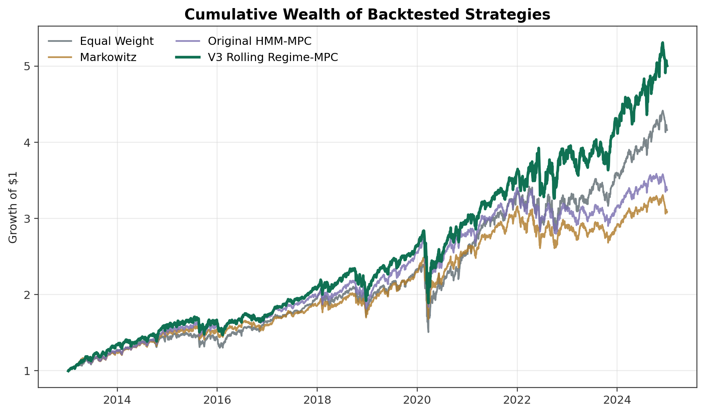
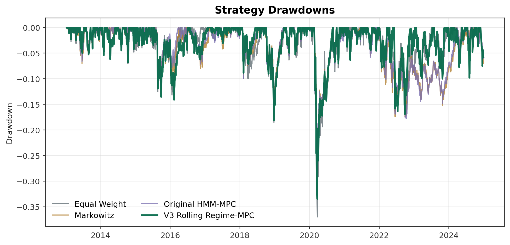
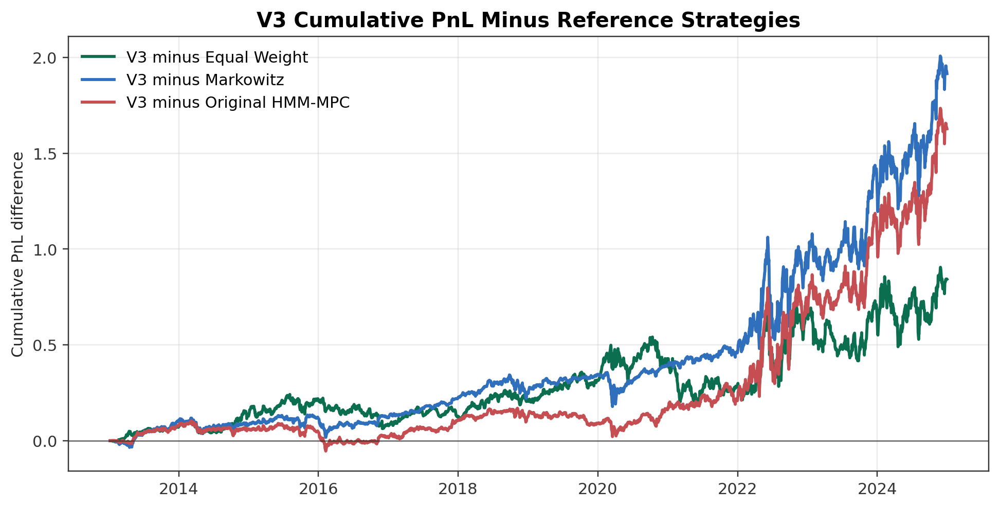
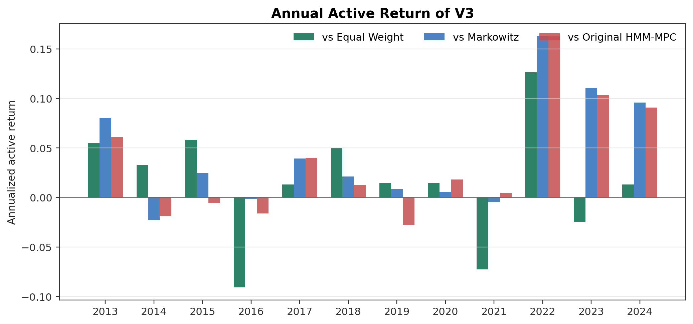
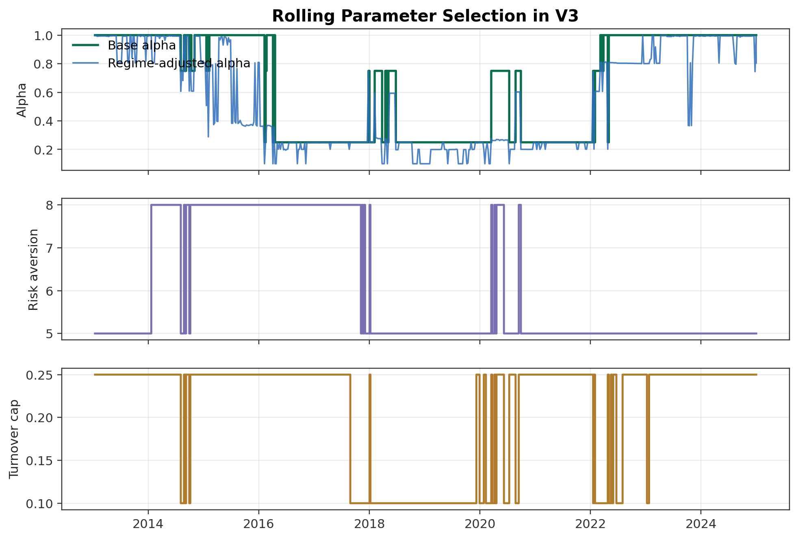
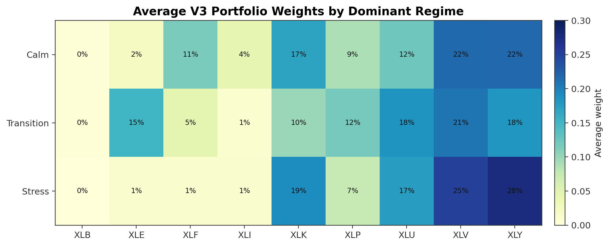
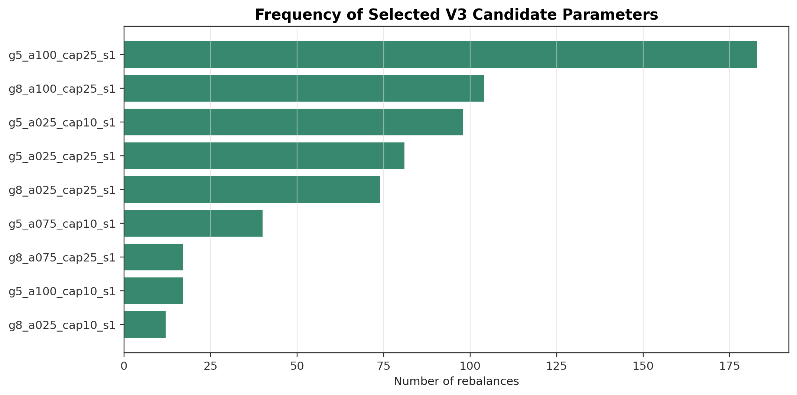

# Empirical Study: Rolling Regime-Aware Multi-Period Portfolio Optimization

## Abstract

This section evaluates the proposed regime-aware convex trading model on a daily U.S. sector ETF universe. The empirical design deliberately uses a small, liquid, and clean asset set so that the main difficulty is the portfolio decision problem rather than data engineering. The backtest compares equal weight, a single-period Markowitz optimizer, the initial HMM-MPC model, and a final rolling regime-aware MPC specification denoted V3. The first HMM-MPC implementation improves drawdown control but underperforms equal weight in net return, mainly because rolling mean return forecasts are noisy and the optimizer becomes too defensive. The final V3 specification addresses this problem by combining robust momentum-based return inputs, regime-dependent alpha shrinkage, and a rolling parameter selection rule that avoids locking future allocations to a fixed validation-period style. In the full 2013-2024 backtest, V3 achieves a 14.40% annualized return, a Sharpe ratio of 0.876, and a final wealth of 5.00, outperforming equal weight, Markowitz, and the original HMM-MPC after transaction costs.

## 1. Data and Asset Universe

The empirical universe consists of nine long-history Select Sector SPDR ETFs:

$$
\mathcal{A} =
\{\text{XLB}, \text{XLE}, \text{XLF}, \text{XLI}, \text{XLK}, \text{XLP}, \text{XLU}, \text{XLV}, \text{XLY}\}.
$$

This universe is intentionally moderate in size. It preserves economic interpretability across major U.S. equity sectors, avoids the survivorship and delisting issues that would arise in a large individual-stock universe, and keeps covariance estimation stable enough for a rolling convex optimizer. The selected ETFs are liquid, have a common history over the full sample, and require no cross-sectional imputation. The empirical design therefore follows the principle that a portfolio optimization experiment should not be driven by an unnecessarily fragile asset panel.

Daily adjusted prices, close prices, and volume are obtained from Yahoo Finance through the chart endpoint fallback used by the project scripts. The market-regime layer also uses daily VIX and U.S. high-yield option-adjusted spread data from FRED, specifically `VIXCLS` and `BAMLH0A0HYM2`. The raw price sample runs from 2010-01-04 to 2024-12-31. Portfolio evaluation begins in 2013 after an initial estimation period, while the pre-2013 observations are retained for rolling moments and regime features.

Daily simple returns are computed from adjusted close prices:

$$
r_{i,t} = \frac{P_{i,t}}{P_{i,t-1}} - 1.
$$

The cleaned return panel contains 3,773 daily observations from 2010-01-05 to 2024-12-31. There are no missing adjusted close, close, or volume cells in the raw sector ETF panel, no zero-volume cells in the cleaned sample, and no missing macro observations after alignment. The only daily return larger than 20% in absolute value is XLE on 2020-03-09, a crisis-period energy-sector move that is retained rather than winsorized because it reflects a genuine market event.

Table 1 summarizes the main data-quality checks.

| Check | Value |
|:--|:--|
| Asset count | 9 |
| Raw price start | 2010-01-04 |
| Raw price end | 2024-12-31 |
| Clean return start | 2010-01-05 |
| Clean return end | 2024-12-31 |
| Return observations | 3,773 |
| Raw adjusted-close missing cells | 0 |
| Zero-volume cells in clean sample | 0 |
| Absolute daily return above 20% | 1 |
| Macro missing after alignment | 0 |
| Regime feature observations | 3,710 |
| Rolling covariance condition number, median | 54.78 |
| Rolling covariance condition number, max | 106.06 |

The individual sector return statistics show substantial cross-sectional variation. XLK has the highest full-sample annualized return at 18.25%, while XLE is the most volatile sector and experiences the deepest drawdown. Defensive sectors such as XLP and XLV have lower volatility and shallower drawdowns. This cross-sectional structure is important because a regime-aware optimizer can easily become too defensive if it overweights low-volatility sectors and underweights high-return cyclical or growth sectors.

| Asset | Annual Return | Annual Volatility | Sharpe | Max Drawdown |
|:--|--:|--:|--:|--:|
| XLB | 8.6% | 20.9% | 0.410 | -37.3% |
| XLE | 6.0% | 27.4% | 0.218 | -71.3% |
| XLF | 11.8% | 22.1% | 0.532 | -42.9% |
| XLI | 13.0% | 19.4% | 0.666 | -42.3% |
| XLK | 18.3% | 21.3% | 0.857 | -33.6% |
| XLP | 10.4% | 13.7% | 0.760 | -24.5% |
| XLU | 9.9% | 17.6% | 0.563 | -36.1% |
| XLV | 12.2% | 16.1% | 0.759 | -28.4% |
| XLY | 15.8% | 20.1% | 0.789 | -39.7% |

## 2. Empirical Protocol

The backtest is designed to approximate a feasible daily investment process. All forecasts, regime probabilities, covariance estimates, and parameter-selection decisions at date \(t\) use information available no later than date \(t\). Trades are implemented on the next trading day. This convention is important because both the HMM layer and the optimizer can otherwise appear stronger than they would be in a real-time setting.

All strategies are evaluated after transaction costs. The base trading-cost rate is 5 basis points per dollar traded and is increased in stressed regimes. Weekly rebalancing dates are inherited from the original empirical script, which uses the last trading day of each week after the initial training window. The main comparison period runs from 2013-01-08 to 2024-12-31, yielding 3,016 daily strategy returns and 626 weekly rebalancing decisions.

The primary performance measures are annualized return, annualized volatility, Sharpe ratio, maximum drawdown, final wealth, average turnover at rebalancing dates, and total transaction cost. For a daily net return series \(R_t\), annualized return is computed from realized compounded wealth:

$$
\text{AnnRet} =
\left(\prod_{t=1}^{T}(1+R_t)\right)^{252/T}-1.
$$

Annualized volatility is the daily standard deviation multiplied by \(\sqrt{252}\). The Sharpe ratio uses zero risk-free rate because the experiment compares equity-sector allocation rules over the same sample and cost assumptions.

## 3. Baselines

The first baseline is a weekly rebalanced equal-weight portfolio. It is simple, transparent, and difficult to beat when expected-return estimates are noisy. The second baseline is a single-period long-only Markowitz optimizer implemented in CVXPY. It uses rolling estimates of expected return and covariance, enforces full investment and long-only constraints, and serves as the classical optimization benchmark.

The initial proposed model is an HMM-informed multi-period MPC optimizer. The HMM is estimated on daily regime features using a rolling window, and the filtered regime probabilities determine conditional expected returns, covariance matrices, and trading-cost multipliers. At each rebalancing date, the optimizer solves a finite-horizon convex quadratic program and executes only the first trade. This model satisfies the project requirement that the proposed strategy be both regime-aware and a multi-period trading convex optimization problem.

The original empirical results are reported in Table 2. Equal weight is a strong benchmark: it has a 12.65% annualized return, a Sharpe ratio of 0.779, and a final wealth of 4.16. The Markowitz strategy reduces volatility and drawdown, but its return is only 9.87%. The original HMM-MPC improves on Markowitz in return and Sharpe, but it still underperforms equal weight in both annualized return and final wealth.

| Strategy | Annual Return | Annual Volatility | Sharpe | Max Drawdown | Final Wealth | Avg Rebalance Turnover | Total Cost |
|:--|--:|--:|--:|--:|--:|--:|--:|
| Equal Weight | 12.65% | 16.24% | 0.779 | -36.98% | 4.159 | 0.58% | 0.36% |
| Markowitz | 9.87% | 14.54% | 0.679 | -32.51% | 3.086 | 4.06% | 2.54% |
| Original HMM-MPC | 10.70% | 14.98% | 0.714 | -32.65% | 3.374 | 1.82% | 1.74% |

The initial HMM-MPC therefore cannot be presented as a finished success. Its value is diagnostic: it shows that regime-aware convex optimization can reduce drawdown and turnover relative to an unconstrained Markowitz implementation, but it also reveals that the return forecast and parameter design must be improved.

## 4. Diagnosis of the Initial Model

The main weakness of the initial HMM-MPC model is the expected-return input. Rolling sample means have low cross-sectional forecasting power in this sector universe. Forecast-quality diagnostics show small Spearman information coefficients across 1-, 5-, and 21-day horizons. The signal is not completely useless, but it is weak relative to the optimizer's sensitivity to expected-return differences. This is a classic mean-estimation problem: small errors in \(\hat{\mu}_t\) can create large portfolio tilts.

The weight diagnostics confirm the economic consequence. The original HMM-MPC heavily tilts toward defensive sectors. Its average weights are approximately 29.5% in XLP, 22.7% in XLV, and 17.2% in XLU, while it assigns little capital to XLB, XLF, XLE, and XLI. This positioning is reasonable during stress, but it becomes costly when market returns are driven by cyclical and growth sectors. The yearly performance table shows that the original HMM-MPC lags equal weight substantially in 2016, 2017, 2021, 2023, and 2024. The diagnostic contribution table also shows that the original HMM-MPC loses relative to equal weight in XLF, XLI, XLB, and XLE, partially offset by stronger contributions from XLP, XLV, and XLU.

The empirical implication is not that regimes are irrelevant. Rather, the regime layer must be paired with a more robust return signal and a more adaptive parameter-selection rule. A static validation choice can lock the optimizer into the style that worked in one historical subperiod. In this data set, a validation period with relatively favorable defensive behavior can produce parameters that shrink alpha too aggressively and then fail to participate in later technology- and consumer-led rallies.

## 5. Final Model: V3 Rolling Regime-MPC

The final empirical specification is V3 Rolling Regime-MPC. It keeps the convex multi-period trading structure but changes the way return forecasts and hyperparameters enter the optimizer. The objective is not to add complexity for its own sake; it is to prevent a fixed validation set from imposing a single market style on the entire future sample.

### 5.1 Momentum-Based Return Input

At each decision date, V3 replaces the raw rolling mean with a robust 12-1 momentum-style signal. The signal uses a 252-trading-day lookback and skips the most recent 21 trading days:

$$
m_{i,t} =
\frac{1}{231}
\sum_{j=22}^{252}\log(1+r_{i,t-j}).
$$

The cross-sectional signal is winsorized and rescaled to the dispersion of the rolling mean, then de-meaned across assets. This preserves the directional information in sector momentum while avoiding the extreme magnitudes that can make a quadratic optimizer unstable.

### 5.2 Regime-Dependent Alpha Shrinkage

V3 does not use one fixed alpha strength in all market states. Let \(q_t^{\text{tr}}\) and \(q_t^{\text{st}}\) denote the HMM next-period probabilities of transition and stress regimes. For a candidate base alpha \(\alpha_0\), V3 uses

$$
\alpha_t =
\operatorname{clip}\left(
\alpha_0
\left[
1 - 0.20q_t^{\text{tr}} - 0.65q_t^{\text{st}}
\right],
0.10,
\alpha_0
\right).
$$

The return input is then

$$
\hat{\mu}_{i,t} = \alpha_t
\left(\tilde{m}_{i,t} - \frac{1}{N}\sum_{j=1}^{N}\tilde{m}_{j,t}\right),
$$

where \(\tilde{m}_{i,t}\) is the scaled momentum signal. Calm regimes therefore allow stronger momentum exposure, while stress regimes automatically shrink the signal and reduce unnecessary trading.

### 5.3 Small Candidate Pool and Rolling Selection

V3 maintains a small pool of 12 candidate policies:

$$
\gamma \in \{5,8\}, \quad
\alpha_0 \in \{0.25,0.75,1.00\}, \quad
\bar{\tau} \in \{0.10,0.25\}.
$$

The stress cost multiplier is fixed at 1.0 in the V3 pool. The MPC horizon is \(H=3\), the single-asset weight cap is 60%, and the base transaction cost is 5 basis points per dollar traded. The candidate pool is deliberately small because selection is repeated through time. A large grid would create excessive computation and increase the risk of data mining.

Each candidate is run as a real-time paper-trading strategy. At a rebalancing date \(t\), V3 observes only candidate returns realized before \(t\). It then selects the candidate with the best rolling score over the previous 756 trading days. During the early period, before at least 252 realized candidate observations are available, V3 uses a strong momentum default candidate.

The selection score combines total performance and performance relative to equal weight:

$$
\text{Score}_{k,t}=
\text{Sharpe}_{k,t}
+0.40\,\text{IR}_{k,t}^{\text{EW}}
+2.00\,\text{ActiveReturn}_{k,t}^{\text{EW}}
+0.15\,\text{DDImprove}_{k,t}^{\text{EW}}.
$$

This score avoids the main weakness of a fixed-validation design. A pure validation Sharpe objective tends to prefer low-volatility defensive policies, even when they lag equal weight in compounded return. The V3 score still rewards risk-adjusted performance, but it also requires the selected policy to justify itself against the most important benchmark in the experiment.

### 5.4 Convex MPC Optimization

Given the selected candidate parameters, V3 solves the same class of convex multi-period trading problem as the theoretical model. At each rebalancing date, the optimizer chooses post-trade weights \(x_h\), buy trades \(b_h\), and sell trades \(s_h\) over horizon steps \(h=1,\dots,H\):

$$
\max_{\{x_h,b_h,s_h\}_{h=1}^{H}}
\sum_{h=1}^{H}
\left[
\hat{\mu}_t^\top x_h
-\frac{\gamma}{2}x_h^\top\hat{\Sigma}_t x_h
-a_t\mathbf{1}^\top(b_h+s_h)
-\frac{\kappa}{2}\|b_h-s_h\|_2^2
\right].
$$

The constraints are

$$
\mathbf{1}^\top x_h=1,\quad
0 \le x_h \le 0.60,\quad
x_h-x_{h-1}=b_h-s_h,\quad
\frac{1}{2}\mathbf{1}^\top(b_h+s_h)\le \bar{\tau}.
$$

The covariance matrix is a 252-day rolling covariance with 15% diagonal shrinkage, scaled mildly by transition and stress probabilities. The problem is solved in CVXPY with OSQP as the first solver. The empirical run completed 626 actual V3 rebalances and 7,512 candidate-policy rebalances, all with optimal solver status.

## 6. Empirical Results

Figure 1 plots cumulative wealth for the full sample. V3 separates from the baselines over time and finishes with a final wealth of 5.00, compared with 4.16 for equal weight, 3.09 for Markowitz, and 3.37 for the original HMM-MPC.



Table 3 reports the main full-sample performance metrics.

| Strategy | Annual Return | Annual Volatility | Sharpe | Max Drawdown | Final Wealth | Avg Rebalance Turnover | Total Cost |
|:--|--:|--:|--:|--:|--:|--:|--:|
| Equal Weight | 12.65% | 16.24% | 0.779 | -36.98% | 4.159 | 0.58% | 0.36% |
| Markowitz | 9.87% | 14.54% | 0.679 | -32.51% | 3.086 | 4.06% | 2.54% |
| Original HMM-MPC | 10.70% | 14.98% | 0.714 | -32.65% | 3.374 | 1.82% | 1.74% |
| V3 Rolling Regime-MPC | 14.40% | 16.43% | 0.876 | -33.45% | 5.001 | 1.36% | 1.04% |

V3 improves annualized return by 1.75 percentage points relative to equal weight and by 3.70 percentage points relative to the original HMM-MPC. Its Sharpe ratio is higher than all three references. Its maximum drawdown is 3.53 percentage points shallower than equal weight, although slightly deeper than Markowitz and the original HMM-MPC. This trade-off is acceptable in the context of the project because the original defensive models gave up too much return for drawdown control.

Figure 2 shows drawdowns. V3 still participates in equity-market drawdowns, especially during the COVID shock and the 2022 selloff, but it avoids the deepest equal-weight drawdown while retaining more upside than the original HMM-MPC.



Table 4 reports excess performance. V3 has a positive annualized active return against every reference strategy. Its information ratio is 0.226 relative to equal weight, 0.603 relative to Markowitz, and 0.515 relative to the original HMM-MPC.

| Comparison | Active Return | Tracking Error | Information Ratio | Annual Return Diff. | Sharpe Diff. | Max DD Improvement | Final Wealth Ratio |
|:--|--:|--:|--:|--:|--:|--:|--:|
| V3 minus Equal Weight | 1.57% | 6.97% | 0.226 | 1.75% | 0.097 | 3.53% | 1.203 |
| V3 minus Markowitz | 4.33% | 7.18% | 0.603 | 4.52% | 0.197 | -0.94% | 1.621 |
| V3 minus Original HMM-MPC | 3.52% | 6.83% | 0.515 | 3.70% | 0.162 | -0.79% | 1.482 |

Figure 3 plots cumulative PnL differences, defined as V3 cumulative PnL minus each reference cumulative PnL. The final PnL advantage is 0.84 over equal weight, 1.92 over Markowitz, and 1.63 over the original HMM-MPC.



The annual active return profile in Figure 4 shows that V3 does not outperform equal weight in every calendar year. It lags equal weight in 2016, 2021, and 2023, but it performs especially well in 2013, 2015, 2018, 2022, and 2024. The 2022 result is important because a simple high-beta momentum strategy might be expected to struggle during a broad equity selloff. V3's regime-dependent shrinkage and rolling candidate selection help preserve positive active performance during that year.



## 7. Parameter and Regime Diagnostics

The rolling selection diagnostics show that V3 does not choose one parameter set for the entire sample. The most frequently selected candidate is \((\gamma,\alpha_0,\bar{\tau})=(5,1.00,0.25)\), selected 183 times. The second most frequent is \((8,1.00,0.25)\), selected 104 times. Low-alpha candidates are also selected frequently, especially during weaker or more defensive periods. This behavior is precisely what a fixed parameter rule cannot provide: strong momentum remains available when it works, but the model can rotate toward weaker alpha when recent realized performance supports it.

| Selected Candidate | \(\gamma\) | Base Alpha | Turnover Cap | Selection Count |
|:--|--:|--:|--:|--:|
| g5_a100_cap25_s1 | 5 | 1.00 | 0.25 | 183 |
| g8_a100_cap25_s1 | 8 | 1.00 | 0.25 | 104 |
| g5_a025_cap10_s1 | 5 | 0.25 | 0.10 | 98 |
| g5_a025_cap25_s1 | 5 | 0.25 | 0.25 | 81 |
| g8_a025_cap25_s1 | 8 | 0.25 | 0.25 | 74 |
| g5_a075_cap10_s1 | 5 | 0.75 | 0.10 | 40 |

Figure 5 displays the selected alpha strength, risk aversion, and turnover cap over time. The selected base alpha switches between weak and strong momentum regimes rather than staying permanently at the defensive value. The effective alpha is lower than the base alpha in periods with elevated transition or stress probabilities.



Figure 6 reports average V3 weights by dominant regime. The model remains economically interpretable: it holds meaningful weights in XLV, XLY, XLK, and XLU, with different allocations across calm, transition, and stress states. Unlike the original HMM-MPC, V3 does not simply collapse into a defensive allocation. It keeps growth and discretionary exposure available while still increasing defensive and health-care allocations when regime conditions warrant.



Figure 7 summarizes selected candidate counts. The selection distribution is concentrated enough to be interpretable but not so concentrated that the rolling mechanism is redundant.



## 8. Discussion and Limitations

The empirical results support the main project hypothesis in its refined form: regime-aware multi-period convex optimization can improve net risk-adjusted performance when the regime layer is combined with robust return inputs and adaptive parameter selection. The original HMM-MPC model alone was not sufficient. It improved drawdown relative to equal weight but sacrificed too much return because it relied on weak rolling mean forecasts and became too defensive. V3 corrects this by preserving 12-1 sector momentum, shrinking alpha in stressed regimes, and selecting parameters from recent realized candidate performance rather than from one fixed historical validation period.

The result should still be interpreted cautiously. First, the model is evaluated on a sector ETF universe in which momentum and technology-sector strength were important over the sample. The same parameter pool may not transfer directly to individual equities, international assets, or futures without new validation. Second, the rolling selection score is a design choice. It is economically motivated because equal weight is the strongest benchmark, but different weights on Sharpe, active return, and drawdown improvement would produce different behavior. Third, transaction costs are modeled as linear and proportional to turnover, with regime-dependent scaling. This is reasonable for liquid sector ETFs, but it does not capture nonlinear market impact. Fourth, the HMM regime probabilities are useful summaries of market conditions, not structural economic states. Their interpretation should remain descriptive.

Finally, V3's strong full-sample performance is not a guarantee of live trading success. It shows that the combination of robust momentum forecasts, regime-aware trading costs, and rolling parameter selection is more effective than the initial HMM-MPC implementation under the historical sample and cost assumptions. The main academic contribution is therefore not a claim of universal alpha, but a tractable empirical demonstration that a regime-aware CVXPY-based MPC framework can be made decision-useful when its return and parameter-selection components are designed to avoid style lock-in.

## 9. Reproducibility

All figures and tables used in this section are generated from saved CSV outputs. The paper assets are produced by:

```bash
/opt/anaconda3/envs/pytorch_py=3.8/bin/python docs/04_empirical_section/scripts/generate_empirical_assets.py
```

The underlying V3 experiment is produced by:

```bash
/opt/anaconda3/envs/pytorch_py=3.8/bin/python improvements/06_v3_rolling_regime_mpc/run_v3_experiment.py
```

The main source files are:

- `data/processed/returns.csv`
- `data/processed/regime_features.csv`
- `outputs/tables/strategy_performance.csv`
- `outputs/tables/hmm_regime_records.csv`
- `improvements/06_v3_rolling_regime_mpc/results/tables/full_sample_performance.csv`
- `improvements/06_v3_rolling_regime_mpc/results/tables/full_sample_excess_vs_references.csv`
- `improvements/06_v3_rolling_regime_mpc/results/tables/selected_params_over_time.csv`
- `docs/04_empirical_section/tables/`
- `docs/04_empirical_section/figures/`
